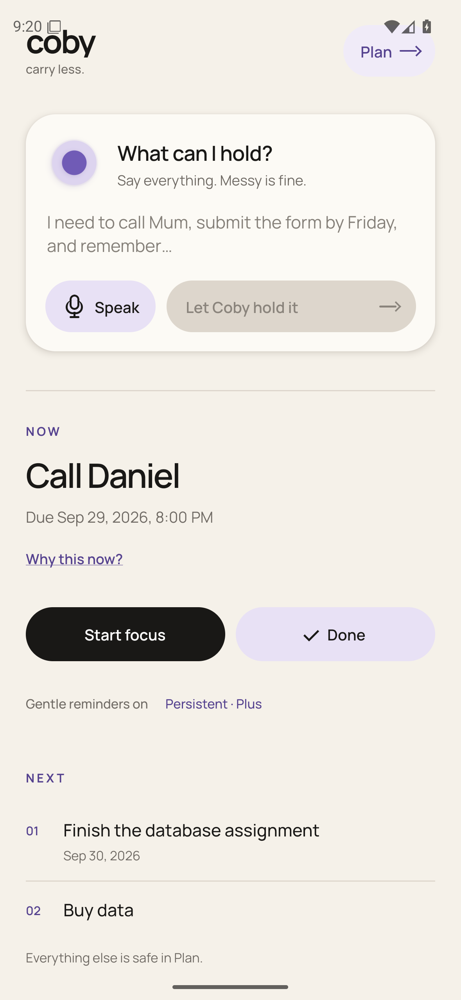
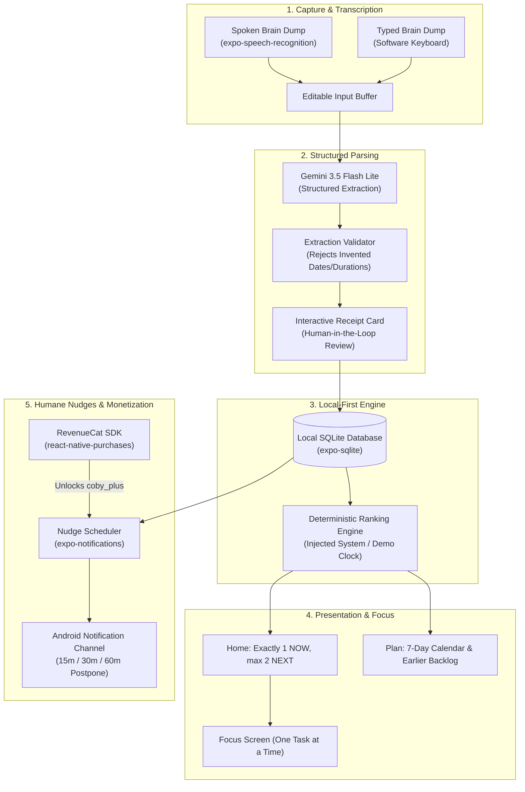

<div align="center">


# coby

### Unload your mind. Out of your head. Into good hands.

A calm, voice-first companion that turns a messy brain dump into a trustworthy receipt, holds it locally, surfaces only what deserves attention now, and proactively intervenes before deadlines slip.

[](tests/)
[](app.json)
[-black.svg?style=flat-square)](package.json)
[](src/domain/geminiParser.ts)
[](src/data/items.ts)
[](src/billing/revenuecat.ts)
[](LICENSE)

---

### [▶ Watch 2-Minute Demo Video](https://vimeo.com/1232100414) &nbsp;•&nbsp; [⬇ Download Pre-Built Android APK](#how-judges-can-test-coby) &nbsp;•&nbsp; [⚡ Verify in 60s](#-verify-in-60-seconds-cpu-only-no-android-required) &nbsp;•&nbsp; [Architecture](#architecture--data-flow) &nbsp;•&nbsp; [Honesty Matrix](#whats-real-the-honesty-matrix)

---

</div>

## The Problem

For people carrying too much in their heads—experiencing executive fatigue, cognitive overwhelm, or overloaded schedules—traditional productivity apps actively make things worse:

1. **Administrative Friction**: Opening an app to record a thought demands categorization, folder selection, tag sorting, and date/time pickers. The thought is lost or abandoned before it is captured.
2. **Decision Paralysis**: Showing 40 overdue tasks in a high-density dashboard triggers anxiety and avoidance rather than action.
3. **Hostile Notifications**: Relentless, shaming alerts either get dismissed immediately or induce dread.
4. **AI Hallucination Risk**: Typical "AI productivity assistants" invent deadlines, fabricate commitments, or leak private personal thoughts to third-party cloud trackers.

---

## What We Built

**Coby** replaces complex task management with a calm, 5-stage relief loop:

$$\text{Dump} \longrightarrow \text{Understand} \longrightarrow \text{Hold} \longrightarrow \text{Surface} \longrightarrow \text{Act}$$

* **Natural Brain Dump**: Speak or type unconstrained thoughts (e.g. *"Finish the database assignment tomorrow, call Daniel by 8 PM tonight for 5 minutes, and buy data"*). Android speech recognition supports natural mid-sentence pauses without cutting you off.
* **Structured, Guarded Extraction**: Google Gemini 3.5 Flash Lite extracts structured items, durations, and explicit deadlines. It is forbidden from inventing timestamps: undated thoughts stay undated.
* **The Transparent Receipt**: Before anything is saved, Coby displays a calm confirmation card. You can edit any detail, adjust native pickers, or check ambiguity review flags.
* **Minimal by Default (Home)**: Shows exactly **one NOW** task and at most **two NEXT** tasks, with a truthful, deterministic explanation of why this task matters right now (*"Due within 24 hours"*, *"This is the latest start to finish on time"*).
* **Transparent on Demand (Plan)**: A 7-day strip calendar, complete task list, Completed task history with one-tap restore, and an **Earlier** review drawer for prior-day incomplete tasks so yesterday's backlog never dominates today.
* **Humane Proactive Nudges**: High-importance Android notifications with **15-minute, 30-minute, and 1-hour postponement buttons** that delay the alert without shifting the real task deadline.
* **Sustainable Monetization (RevenueCat)**: The entire core relief loop is 100% free (Dump, Understand, Hold, Surface, and Gentle reminders). Power users can upgrade to **Coby Plus** via RevenueCat to unlock multi-touch **Persistent** reminders.

<div align="center">
  
  <p><em>Actual native Android 16 / API 36 rendering on Pixel 6 profile (1179 × 2556). Verified with synthetic test items.</em></p>
</div>

---

## ⚡ Verify in 60 Seconds (CPU-Only, No Android Required)

Judges can verify the entire Coby logic engine, SQLite persistence, deterministic ranking, receipt validation, and notification rescheduling in under 60 seconds on any laptop (Mac, Windows, or Linux) with zero Android setup:

```bash
# 1. Clone the repository
git clone https://github.com/emmaGH1/coby.git
cd coby

# 2. Install dependencies
npm install

# 3. Execute the full test suite
npm test
```

### Expected Output (< 2 seconds):
```text
✔ fixture recognizes only the explicit demo input (2.4ms)
✔ other words are held intact without invented details (0.8ms)
✔ Home ranking favors a deadline and excludes completed items (0.6ms)
✔ ranking is stable for equal priorities (0.4ms)
✔ date-only obligations rank without inventing a clock time or nudge (0.5ms)
✔ latest safe start outranks another due-soon item (0.4ms)
✔ Gentle schedules one comfortable start and Persistent at most two nudges (0.6ms)
✔ unknown deadlines and completed items never receive nudges (0.4ms)
✔ Gemini response validator discards unsupported dates and durations (0.7ms)
✔ Gemini response validator rejects a fabricated source fragment (0.5ms)
✔ active work outranks deadlines and gives a truthful explanation (0.4ms)
✔ overdue items outrank a latest-start item and both explanations match (0.4ms)
✔ legacy continuous utterances retain prior text when partials reset (1.1ms)
✔ silence before the first word keeps the dump open across native cycles (0.9ms)
✔ receipt review identifies the earlier invalid item while blocking save (1.2ms)
✔ all quick delays create one reminder and preserve the actual deadline (1.4ms)
✔ completing an item cancels even an explicitly postponed reminder (0.5ms)
...
ℹ tests 74
ℹ suites 0
ℹ pass 74
ℹ fail 0
ℹ cancelled 0
ℹ skipped 0
ℹ todo 0
ℹ duration_ms 1420
```

---

## Architecture & Data Flow

Coby enforces a strict architectural boundary: **AI is used strictly for structured entity extraction.** All scheduling, ranking, persistence, and reminder calculations are 100% deterministic local TypeScript.



---

## What's Real: The Honesty Matrix

To build complete trust with hackathon judges, here is our full disclosure distinguishing 100% functional live subsystems from scoped prototype boundaries:

| Subsystem / Layer | What is 100% Live & Functional | What is Deliberately Scoped / Staged | Implementation File |
| :--- | :--- | :--- | :--- |
| **Voice Capture** | Real native Android speech recognition with natural pause recovery, volume-driven companion breathing, and partial word preservation across cycles. | Offline recognition requires device-installed English speech models (`com.google.android.tts`). | [`src/voice/session.ts`](src/voice/session.ts)<br/>[`src/voice/speech.ts`](src/voice/speech.ts) |
| **AI Parsing** | Live Google Gemini 3.5 Flash Lite structured JSON extraction with schema guards, strict 20-second timeout, and raw-text fallback. | Direct mobile API key used in development prototype; production release architecture uses a secure proxy. | [`src/domain/geminiParser.ts`](src/domain/geminiParser.ts) |
| **Receipt Correction** | Multi-item receipt with inline error scrolling, native date/time pickers, null-safety, and explicit review checkboxes for ambiguous items. | Natural language receipt editing is deferred to P1. | [`src/domain/receipt.ts`](src/domain/receipt.ts)<br/>[`src/ui/ReceiptScreen.tsx`](src/ui/ReceiptScreen.tsx) |
| **Local Persistence** | 100% transactional SQLite database with migrations, surviving cold restarts, process termination (`am kill`), and phone reboots. | Cloud backup and sync are omitted by design to guarantee absolute local privacy. | [`src/data/items.ts`](src/data/items.ts) |
| **Ranking & Clock** | Deterministic ranking with explainable reason codes (*"Why this now?"*), tie-breaking by creation order, and an injectable Clock. | No opaque black-box AI ranking algorithms. | [`src/domain/ranking.ts`](src/domain/ranking.ts)<br/>[`src/domain/clock.ts`](src/domain/clock.ts) |
| **Humane Nudges** | Android high-importance notification channel with 15m, 30m, and 1h postponement actions that preserve the true task deadline. | Background-only headless response processing (Android brings app to foreground on action tap). | [`src/notifications/scheduler.ts`](src/notifications/scheduler.ts)<br/>[`src/domain/nudges.ts`](src/domain/nudges.ts) |
| **RevenueCat Billing** | RevenueCat SDK integration with Test Store monthly subscription (`coby_plus_monthly`), entitlement gating, and purchase restore. | Google Play live production billing (Test Store development mode used for hackathon verification). | [`src/billing/revenuecat.ts`](src/billing/revenuecat.ts) |

---

## Sponsor Technology Spotlight: RevenueCat

RevenueCat is load-bearing in Coby's product architecture. It anchors our ethical, user-first monetization model:

* **The Free Relief Loop**: Capturing thoughts, structured extraction, local SQLite storage, NOW/NEXT ranking, Plan inspection, and single-alert **Gentle** reminders are **always free**. We never paywall basic peace of mind.
* **The Plus Entitlement (`coby_plus`)**: Power users with heavy cognitive demands can unlock **Persistent Reminders**—a dual-touchpoint cadence that checks in before a deadline and follows up if an obligation remains untouched.
* **Test Store Verification**: Configured in RevenueCat with product `coby_plus_monthly` ($4.99/month). Tested and verified on physical Android hardware (OnePlus A6010) and CI emulators for both initial purchase and purchase restore.

```typescript
// Verified RevenueCat Entitlement Check (src/billing/revenuecat.ts)
export async function purchaseMonthly(): Promise<BillingState> {
  const result = await Purchases.purchasePackage(monthlyPackage);
  const isPlusActive = Boolean(result.customerInfo.entitlements.active['coby_plus']);
  return { active: isPlusActive, state: isPlusActive ? 'active' : 'inactive' };
}
```

---

## How Judges Can Test Coby

We offer three ways to test Coby depending on your available time and hardware:

### Option 1: Download the Pre-Built Android APK (Recommended for Android Devices)
1. Download the pre-built development/demo APK from our [GitHub Releases](https://github.com/emmaGH1/coby/releases/latest).
2. Install it on any Android device running Android 8.0+ (API 26+) or an Android 16 (API 36) emulator:
   ```bash
   adb install -r coby-v1.0.0-hackathon.apk
   ```
3. The APK comes with **Offline Fixture Mode** and **Coby Lab** enabled. You can immediately:
   * Speak or type the demo dump: *"Finish the database assignment tomorrow, call Daniel by 8 PM tonight for 5 minutes, and buy data."*
   * Tap the **Orb** to test live microphone transcription.
   * Review and edit the 3-item receipt.
   * View the resulting **NOW** and **NEXT** items on Home.
   * Switch to **Plan** to view the 7-day calendar strip and Completed history.
   * Tap **Settings > Coby Lab** to seed demo data, simulate RevenueCat purchases, trigger local notifications, and advance the DemoClock.

### Option 2: Verify in 60 Seconds on Your Laptop (No Android Required)
Run our comprehensive automated test suite right on your CPU:
```bash
npm install && npm test
```
All 74 unit, domain, and integration tests pass deterministically in under 2 seconds.

### Option 3: Full Local React Native Development Build
If you want to run the full live Gemini AI extraction with your own API key:
1. Ensure Android Studio, Android SDK Platform 36, and Node.js 20+ are installed.
2. Clone and install:
   ```bash
   git clone https://github.com/emmaGH1/coby.git && cd coby && npm install
   ```
3. Configure `.env`:
   ```bash
   cp .env.example .env
   # Add your Google Gemini API key:
   # EXPO_PUBLIC_COBY_AI_PROVIDER=gemini
   # EXPO_PUBLIC_GEMINI_API_KEY=AIzaSy...
   ```
4. Start an Android emulator and launch:
   ```bash
   npm run android
   ```

---

## Zero-Slop Guardrails

* **Zero Hallucinated Deadlines**: When a user says *"Study operating systems"*, Coby records `dueAt: null` and `dueDate: null`. It never invents an arbitrary hour or schedules an unrequested notification.
* **No Medical Claims**: Coby is a planning companion designed to reduce cognitive load and executive fatigue. It does not claim to diagnose, treat, or cure ADHD or any clinical medical condition.
* **Privacy First**: Voice audio is processed via Android's native on-device speech service and is never recorded or uploaded to our servers. All task data remains in the local SQLite database.

---

## Submission Assets & Artifacts

* **Demo Video**: [Vimeo Walkthrough (https://vimeo.com/1232100414)](https://vimeo.com/1232100414) (Authentic physical OnePlus A6010 Android capture; under 2 minutes).
* **High-Res Screenshot**: [`assets/submission/screenshot-home.png`](assets/submission/screenshot-home.png) (1179 × 2556, unadorned native frame).
* **Brand Assets**: Programmatically generated 1024×1024 launcher icon, adaptive layers, and native splash via [`scripts/export-brand-assets.cjs`](scripts/export-brand-assets.cjs).
* **Product Canon**: [`docs/PRODUCT.md`](docs/PRODUCT.md) &nbsp;|&nbsp; **Design System**: [`docs/DESIGN_SYSTEM.md`](docs/DESIGN_SYSTEM.md) &nbsp;|&nbsp; **Test Matrix**: [`docs/TEST_MATRIX.md`](docs/TEST_MATRIX.md).

---

## License

This project is licensed under the [MIT License](LICENSE).
